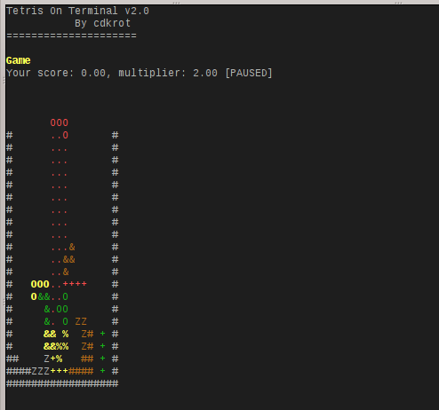

# Hello on tetris-on-terminal
Tetis-on-terminal is a tetris game with CLI interface. I offer you classic tetris and cool "rainbow" mode. Try it out.



## How to install.

To get the tetris-on-terminal you need this dependencies:

1. Unix-like environment.
2. Ncurses library.
3. C++11 compiler (for example g++).

### Step 1: download sources.
```sh
    $ git clone https://github.com/cdkrot/tetris-on-terminal
    $ cd tetris-on-terminal
```

### Step 2: compile.
```sh
    $ ./build-REL.sh    # ./build-DBG.sh if you want to get dev binary.
```

### Step 3: run.
```sh
    $ ./bin/tetris-on-terminal
```

### Step 4: enjoy!
